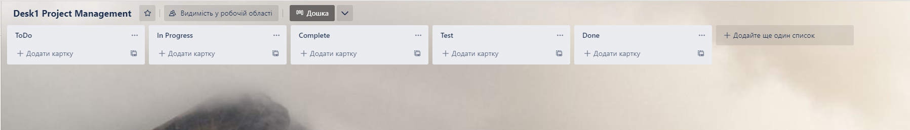

# Team and project
## Team code/name
> Команда номер 9

## Team members list 
1. > Боровік Н.І. - **team leader**
1. > Близнюк І.О.
1. > Бурляй Д.Ю.
1. > Тарасенко С.В.
1. > Зимовець Р.О.

## Unity version
> 2021.3.11f1

 

# Lab
## About team task management (screenshot/description)

*To Do:* список завдань, що треба зробити.

*In Progress:* список завдань, що виконуються.

*Complete:* список завершених завдань, які ще не було протестовано.

*Test:* список завдань на тестуванні в тестуванні.

*Done:* список завершених завдань.
## Chosen games analysis
### Bloodborne

Учасник команди: Боровік Н.І.

Жанр: Action-adventure/RPG/survival-horror

Тематика: гротескне готичне європейське місто 18-19 сторіччя

Ціль гри: пережити ніч полювання та подолати кошмар мисливця

Важливими складовими bloodborne є висока складність та динамічна бойова система. Герой зустрічається з багатьма сильними та небезпечними чудовиськами, що з легкістю можуть його вбити. У бою гравцю потрібно бігати, перекочуватися, лікуватися, парирувати та використовувати багато різних атак своєї зброї.Битви проходять швидко і дуже часто закінчуються загибеллю героя, через це кожна перемога приносить гравцям справжню насолоду.Також складність досягається тим, що після смерті гравець втрачає усю свою ігрову валюту і має лише один шанс підібрати її назад, якщо потрапить на місце своєї смерті та не помре дорогою, інакше він втратить цю валюту назавжди.

Складовими Bloodborne також є багато різноманітних ігрових систем:

Система локацій: кожна локація реперезентує собою певну частину міста Ярнаму/ підземелля під ним, вона наповнена ворогами та обов’язково закінчується зустріччю з босом. Усі локації пов'язані між собою через hub-локацію "сон мисливця" , в яку можна потрапити, повзаємодіявши з ліхтарем. Тут можна прокачувати рівні, вдосконалювати зброю, купувати нові предмети. З цієї локації герой може потрапити у будь-яку раніше відвідану локацію гри.

Система характеристик: сила персонажа залежить вид рівня його характерістик, що відповідають за кількість його здоров’я , витривалості, можливість викорістання певної зброї та кількисть шкоди , що вона наносить. Таким чином можливо створити свій власний архетип героя , що найкращим чином буде розкривати потенціал обраної зброї та стилю гри. 

Сістема прокачки персонажа: знищення будь-якіх ворогів та босів несе за собою винагороду у вигляді ігрової валюти (відголосків кровавіку) , яку можна витратити , щоб збільшити власні характеристики та полегшити гру.

Система зброї: уся зброя у грі поділяється на два типи - основну зброю ближнього бою та допоміжню дальнього. Кожен варіант зброї унікальний і має свої особлівості. Кожен варіант основної зброї має другу форму, що додає нові варіанти атак, до неї можна перейти прямо під час битви. Саме ці особлівості роблять бойову систему цікавою та різноманітною.

Система прокачки зброї: кожну зброю можна підсили , збільшивши її рівень на верстаті. Для цього потрібно витратити ігровій ресурс - шматки кровавіку. Також зброю можливо підсилити або навіть наділити унікальними властивостями, вставивши у нього кроваві самоцвіти (артефакти, що іноді трапляються у місти та потрібні саме для вдосконалення зброї).

Система рун: під час гри герой може знайти древні руни, що здатні підсилити його , збільшуючи певні характеристики або навіть даючи незвичайні особливі бонуси (наприклад перетворити на монстра і підсилити певний вид зброї)

### God of War

Учасник команди: Близнюк І.О.

Жанр: Экшн-пригода

Герой бере на себе роль Кратоса – бога війни, що намагався почати вести мирне життя. Події гри відбуваються в сеттингу скандинавської міфології замість грецької.

Складові геймплею:

RPG-складова:

як вороги, так і гравець мають певний рівень, що відображає їх силу, тобто дуже легко перемагати ворогів, які на 1-2 рівні нижчі за гравця і навпаки – дуже складно (а іноді й неможливо) перемагати ворогів, які на декілька рівнів вищі. Рівень гравця залежить від рівня та потужності його спорядження та кількості опанованих навичок.

Бойова складова:

 на шляху героя постійно трапляються вороже налаштовані персонажі (люди, тварини, монстри та навіть боги), для боротьби з якими існує ціли арсенал зброї. 
1.	Герой може атакувати ворогів своєю сокирою «Левіафан», завдаючи багато шкоди (та після опанування відповідного навичка, сповільнюючи ворогів).
2.	 Можна атакувати голими руками, шо завдає значно меншої шкоди, але заповнює шкалу приголомшення, після заповнення якої, можна провести добивання, що моментально вбиває ворога.
3.	 Згодом, герой отримує «Леза Хаосу», що також завдають меншої шкоди, ніж «Левіафан», але дозволяють зачіпати одразу цілий натовп та завдають шкоди від вогню
4.	Герою допомагає його син Атрей, який може стріляти з лука по команді гравця, що завдає ворогам шкоди та накладає ефекти залежно від обраних стріл. Також син може застосовувати закляття обране героєм.
5.	Герой може ухилятись від атак ворогів, або блокувати їх щитом (не всі атаки можна заблокувати). За допомогою щита також можна виконати парирування, якщо виставити його за мить до атаки ворога, тоді герой відіб’є атаку, що залишить супротивника відкритим для контратаки.

Розвідувальна складова:

У грі присутній відкритий світ, який можна досліджувати в пошуках ресурсів, квестів та нових ворогів. В багатьох навіть сюжетних локаціях є непомітні відгалуження від основного шляху, де можна знайти цінні ресурси або ігрову валюту (рублене срібло). Також, іноді гравцю потрібно повертатися в раніше відвідані локації, бо їх частини можуть бути недоступні до отриманні певного предмета або здібності (наприклад, деякі проходи та скрині заблоковані корінням, яке можна знищити лише Лезами Хаосу, які герой отримає в 2 половині гри).

Крафтинг складова:

Герой може виготовляти та покращувати обмундирування за допомогою ресурсів, знайдених під час гри та ігрової валюти.

### Gravity Rush

Учасник команди: Бурляй Д.Ю.

Жанр - open world, action-adventure

Завʼязка - героїня втрачає памʼять. Незабаром вона знаходить в собі можливості змінювати гравітацію для себе та інших обʼєктів, на яких і базується основний геймплей.

Основні механіки: переміщення - світ гри - чотири літаючих острови, які формують собою місто. Переміщення відбувається за допомогою зміни гравітації та “падіння у будь-який бік”. Якщо правильно змінити гравітацію, то можливо “їздити будь-якою поверхнею” - від землі до стін будинків. Героїня може змінювати вагу, що кардинально змінює переміщення: зі збільшеною вагою буде більш швидке ковзання, коли ж зі зменшеною буде більш плавне “стрибання з будинку на будинок”.

Основні механіки: бойовка - бойова система працює також здебільшого за допомогою механіки зміни гравітації. ГГ може змінювати гравітацію для предметів та кидати їх у ворогів, а інколи кидати самих ворогів. Також присутній ближній бій з класичними уворотами та різними атаками. Раніше зазначена можливість змінювати вагу допомагає у потрібний момент збільшити свою силу, або ж збільшити швидкість, що потрібно проти різних ворогів. 

Основні механіки: вороги - вороги здебільшого або наземні, або летючі, але в усіх є слабке місце, ядро, яке треба розламати, аби ж перемогти. Якщо все відносно просто з наземними, то без зміни гравітації летючих ворогів не подолати: або кидай у них предмети, або зміни гравітацію щоб врізатись прямо в ядро. Самі вороги будуть бити на великих дистанціях та стріляти, чим примушують використовувати “третій вимір” для уникнення шкоди. Боси зазвичай мають декілька ядер та певні умови, які треба виконати щоб мати змогу розбити їх.

Стилістика гри - гра відбувається у фантастичному світі, де літають лише кілька островів, а внизу та вгорі, здається, лише пустота. У гри напів-аніме стиль, тому вона має багато стилістичних елементів цього жанру. Місто виконано у стилі стімпанк. Загалом і музика, і зовнішній вигляд доволі нуарні. 

Левел дизайн - як уже було зазначено, основні події відбуваються у летючому місті, але містика гри тут не завершуються, бо за мірою проходження гравець потрапляє у “чорні діри”, де повністю інші закони, що може змінювати як основні механіки, там і пропонувати повністю іншу стилістику, наприклад: невеликий світ з гігантських рослин, де майже не має можливості керувати гравітацією, або ж світ повністю з лави, де є лише невеликі тунелі по яких можливо рухатись. Ці рівні часто перевіряють майстерність володіння гравітацією, адже час польоту обмежений

Поєднуючи все це отримуємо дуже цікавий та містичний світ, у якому просто приємно навіть літати під музику, та гру, у якій цікаво розбиратись, шукати відповіді на купу запитань та експериментувати зі своїм стилем гри.

### Duck Game

Учасник команди: Тарасенко С.В.

Жанр: Action game

Тематика: Битви на виживання качок у космосі та на землі 

Особливості графіки: піксельна, поліхромна.

Ціль гри: Перемоги у матчах у мультиплеєрі та проходження усіх випробувань в одиночній частині  

Cистема рівнів: Існує 2 основних типи рівнів:

1.	Створені вручну
2.	Автоматично згенеровані або «порожні»
У грі вбудовано редактор рівнів, тому кожен може вільно робити свої рівні, тому є ще один поділ рівнів – оригінальні, тобто ті, що було створено розробниками, та «кастомні» - створені гравцями.
Порожні рівні генеруються самосійною, мають виразні візуальні риси. Перед кожною ігровою сесією її власник може налаштувати відсоткове співвідношення оригінальних, «кастомних» та «порожніх» рівнів, що будуть використовуватися у сесії. 

Система персонажів: Гравці грають за озброєних космічних качок, що борються за титул кращого. Гравці можуть вільно об’єднуватися прямо під час гри, наприклад, тільки на 1 рівень або перед початком гри об’єднатися у групу, що означитиме, якщо в кінці вижив хоча б один учасник команди, то вона перемагає. Качки помирають одразу якщо їх торкається навіть найменша кулька або їм на голову впаде камінь, ящик, бочка, тощо.  Після початку кожного нового рівня усі качки відроджуються і переміщаються на початкові позиції.

Система капелюхів та кольорів: Оскільки в 1 ігровій сесії може бути до 8 качок, для кожної качки є її унікальний колір: білий, сірий, жовтий, помаранчевий, рожевий, фіолетовий, синій, зелений. Гравець може обирати собі колір з цього переліку, за умови, що він не зайнятий іншим. Також кожен має доступ до системи капелюхів, які є дуже важливими для ідентифікації свій-чужий, оскільки качки з однаковими капелюхами є командою.

Особливості переміщення та стрільби: Качка може ходити вправо, вліво, а також стрибати вверх, планувати вниз та падати. Стріляти можна вліво, вправо та вверх, але також за наявності досвіду та відповідних навичок гравець може почати стріляти по-діагоналях, що дозволяє не тільки легше вбивати противників, але і  дає можливість переміщатися по-діагоналях також.   

Особливості нанесення шкоди ворогу: Качка гравця помирає, якщо в неї попадає куля зі зброї, навіть власної, якщо її спалити або вразити мечем, також, якщо на голову качці впаде ящик, камінь, бочка або інша качка у спеціальних чоботах, тоді вона також загине.

Особливості зброї, та важких предметів та броні: у грі присутньо дуже багато різноманітної зброї: лазери, пістолети, автомати, рушниці, мечі, вогнемети, ґвинтівки, що можуть або не можуть прострілювати качок, ящики, двері наскрізь. Також на рівнях можуть бити присутні «важкі предмети» - ящики, каміння, бочки або надгробок, які можна також взяти у руки і кинути у ворога і якщо попасти по голові качки, то це її вб’є. Також кидати можна і зброю, і при попаданні у іншу качку, це вибиває у неї з рук її зброю або важкий предмет. У грі доступно 2 шоломи, 1 нагрудний обладунок, 2 пар черевиків та реактивний ранець. Броня захищає від пострілів із деяким шансом, шолом захищає від попадання важким предметом по голові, ранець дозволяє літати, а черевики дають можливість чавити ваших ворогів, ходити по шипах або лазити по стінах.

### Borderlands 2
Учасник команди: Зимовець Р. О.

Жанр: шутер з видом від 1-ї особи з елементами RPG.

Тематика: постійний розвиток персонажа та боротьба з навіженими та, часто, психічно нестабільними ворогами.

Ціль гри: врятувати планету Пандору від загребущих рук злодія Красунчика Джека.

Cистема локацій: у грі присутня велика кількість локацій, які в разом утворюють Мапу Borderlands 2. Кожна локація – деяка місцевість планети Пандори, на якій розгортаються події. Не всі локації є обов'язковими для відвідування, однак кожна з необов'язкових містить свої секрети, пасхалки, незвичайні квести тощо. Кожна локація містить постійні місця спавну звичайних ворогів, а також місця спавну ворогів, причетних до якихось квестів. Відповідно, деякі частини локацій стають доступними лише після проходження певних квестів.

Система персонажів: у Borderlands 2 присутні 4 основних персонажі (+2 додаткові), за яких можна пограти : Екстон, Майя, Сальвадор, Зер0 (+ Гайка та Криг). Сюжет не залежить від вибору персонажа. Також присутня можливість грати у команді зі своїми друзями, що виглядає просто як групове проходження одного і того ж сюжету. Персонажі також не впливають на можливість користуватися певними видами зброї: граючи за будь-кого, можна використовувати будь-яку зброю. Однак, у кожного персонажа свій набір навичок, які можна розвивати у ході гри, а також свої особливі здатності, які можна підсилити навичками. Головна шкала розвитку персонажа – шкала рівнів.

Система ворогів: вороги поділяються на перетинні класи: звичайний ворог, неоднозначний ворог (ключовий персонаж, який може стати ворогом), ключові вороги (боси). Звичайні вороги – мутанти, психи, гіперіонські роботи, які спавняться в постійних місцях спавну або супроводжують основний потік бою під час проходження квестів.  Ключові вороги (боси) можуть бути або сюжетними, або секретними. Неоднозначні вороги теоретично можуть бути як звичайними ворогами, так і ключовими ворогами. Єдина їх особливість – вони  можуть стати агресивними до ГГ, за умови, що ним були виконані певні дії, які спричиняють цю агресію. 

Особливості переміщення: переміщення ГГ – стандартне 3-вимірне : звичайний рух та біг у площині, а також стрибки та присяж – уздовж вертикальної осі. Переміщення між локаціями відбувається шляхом телепортації у спеціально відведених для цього пунктах, розміщених на кожній локації.

Особливості нанесення шкоди ворогу: шкода наноситься шляхом рукопашного бою, стрільби, падіння. У кожного персонажа є шкала здоров'я. Коли здоров'я ГГ закінчується, він переходить у режим «боротьби за життя», який триває деякий час і до закінчення якого ГГ має вбити одного ворога, аби оживитися. Також у деяких персонажів є щит, який є елементом екіпірування. Кожен щит має зафіксовану кількість шкоди, яку він може поглинути (назвемо це життям щита). Коли персонажу, екіпірований щитом нанесено кількість шкоди, яка перевищує життя щита, то шит «розбивається» і деякий час персонаж має уникнути отримання шкоди, аби щит відновився. Якщо ж він продовжить отримувати шкоду, буде зніматися основне здоров'я.

Особливості зброї: існує 3 поділи зброї на класи:

За механічним типом зброї:

•	Пістолети (враховуючи автопістолети та револьвери)

•	Пістолети-кулемети

•	Штурмові гвинтівки (враховуючи автоматичні кулемети)

•	Дробовики

•	Снайперські гвинтівки

•	Ракетомети

За рідкісністю:

•	Біле (звичайне)

•	Зелене (не набагато рідше за біле)

•	Синє (зустрічається рідко, може бути унікальним)

•	Фіолетове (ще потужніше і зустрічається рідше) 

•	E-Tech (серійна зброя, оснащена особливим стволом, за рідкістю майже як фіолетова)

•	Оранжева/легендарна (випадає надзвичайно рідко зі звичайних противників, та частіше з конкретних ключових персонажів)

•	Серафимівське (дуже рідкісне, випадає тільки з певних босів або купується за Кристали Серафима)

•	Перламутрове (найвищий рівень рідкісності)

За видами шкоди:

•	Нестихійна

•	Вогняна

•	Корозійна

•	Шлакова

•	Шокова

•	Вибухова

За ігровим виробником:

•	Джейкобс (зброя одиночних пострілів)

•	Тедіор (зброя, що кидається як граната після перезарядки)

•	Владоф (зброя з дуже великою швидкострільністю)

•	Торрг (зброя, що стріляє вибуховими боєприпасами)

•	Даль (зброя, що стріляє напівавтоматично або чергами під час прицілювання)

•	Гіперіон (зброя, що підвищує свою точність з кожною секундою неперервної стрільби)

•	Маліван (зброя зі стихіями)

Фінансова система: існують 5 валют : звичайні гроші, золоті ключі, Кристали Серафимів, Ерідій, жетони Торрга (лише з DLC “Mr. Torgue’s Campaign of Carnage”). Покупки у торговців здійснюються за звичайні гроші. Золоті сундуки можна відкривати за золоті ключі. За Кристали Серафимів можна торгувати з Торговцями Серафима. За еридій можна купувати різні покращення на «чорному ринку» у Божевільного Ерла. Жетони Торрга можна обміняти на досить цінну зброю у торгівельних автоматах на локації «Божевільний кратер божевільності». 
Звичайні гроші та Еридій можна знайти в ящиках з припасами або вибити з ворогів. Кристали Серафимів можна добути, лише вбиваючи «стражників-серафимів», які є ключовими ворогами. Жетони Торрга отримуються на арені на локації «Божевільний кратер божевільності».

Квестова система: у грі є 2 квестові потоки: основний сюжетний, а також другорядний. Основний сюжетний потік квестів розпочинається у самому початку гри і закінчується, крои був виконаний останній квест із потоку. Другорядні квести не є обов'язковими; отримати їх можна як у ключових персонажів, так і просто у деяких місцях локацій. За будь-який виконаний квести ГГ надається нагорода, яка може містити що завгодно: зброю, якусь кількість якихось грошей, еридію тощо.

